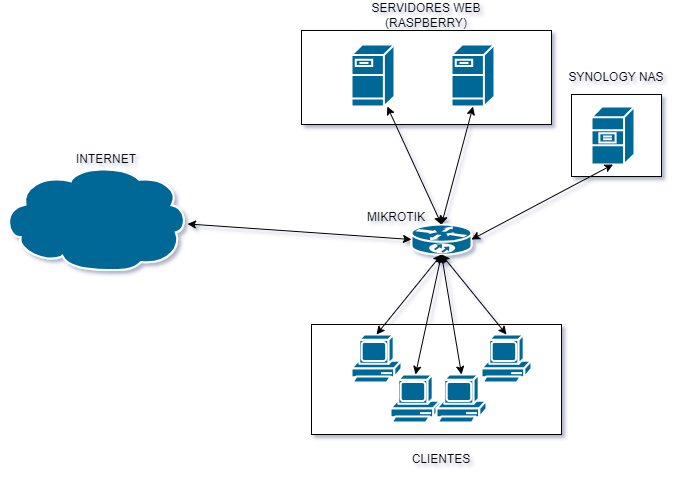
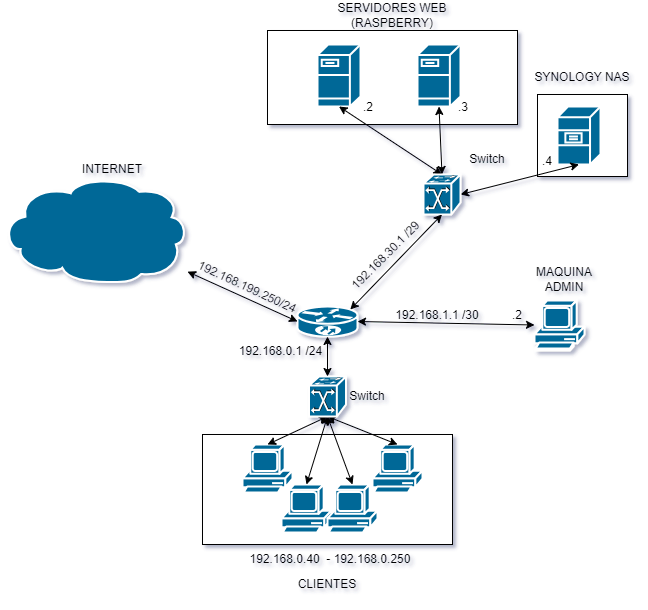

# 🛡️ RaspiVault – Caja fuerte digital con 2FA en Raspberry Pi

**RaspiVault** fue mi proyecto final del ciclo **ASIR** (Administración de Sistemas Informáticos en Red), presentado en 2023.  
Consiste en una **caja fuerte digital** desarrollada con **Raspberry Pi**, que implementa **autenticación multifactor (2FA)** mediante teclado físico y código TOTP compatible con Google Authenticator.

Fue muy bien valorado por el profesorado, destacando por su enfoque técnico y práctico.
Este repositorio sirve como muestra técnica y visual del proyecto, ideal para compartir, aprender o replicar.

---

## 🌐 Diseño de red del proyecto

### 🗺️ Topología lógica de red

  

> Representa la distribución y conexión lógica de los dispositivos de red: routers, servidores, clientes, Raspberry Pi y autenticador móvil.

---

### 🧠 Diseño IP y subredes

  

> Este diagrama incluye las subredes, direccionamiento IP y la segmentación lógica de servicios y usuarios.

---

### 📋 Tabla de direccionamiento de red

| Interfaz | Subred           | IP asignada       | Máscara              | Tipo       | Descripción     |
|----------|------------------|-------------------|----------------------|------------|-----------------|
| eth1     | 192.168.199.0    | 192.168.199.250   | 255.255.255.0 (/24)  | WAN        | INTERNET        |
| eth2     | 192.168.30.0     | 192.168.30.1      | 255.255.255.248 (/29)| LAN        | SERVIDORES      |
| eth3     | 192.168.0.0      | 192.168.0.1       | 255.255.255.0 (/24)  | LAN        | USUARIOS        |
| eth4     | —                | —                 | —                    | LAN        | VACÍO           |
| eth5     | 192.168.1.0      | 192.168.1.1       | 255.255.255.252 (/30)| LAN        | ADMINISTRACIÓN  |

---

## 📄 Documentación completa

📚 Puedes consultar el documento original completo en formato PDF aquí:

👉 [**Ver documentación técnica RaspiVault**](docs/RaspiVault_documentacion.pdf)

Incluye:
- Introducción y objetivos
- Diseño lógico y físico
- Arquitectura de red y seguridad
- Implementación del sistema de 2FA
- Capturas del proceso funcional
- Conclusiones

---

## 🧰 Tecnologías utilizadas

- 🐍 **Python**
- 🍓 **Raspberry Pi OS**
- 🔐 **Google Authenticator** (TOTP)
- ⌨️ **Teclado físico / keypad**
- 🔌 **Electrónica básica (relé, LEDs)**
- 📶 **Diseño de red IP y subredes**
- 📝 Documentación con **LibreOffice Writer**

---

## ❓¿Dónde está el código?

> En el momento de desarrollo no usaba GitHub ni sistemas de control de versiones, por lo que **no conservo el código fuente original**.  
> Este repositorio está enfocado en la **documentación técnica, visual y estructural del proyecto**.

Estoy abierto a colaborar con personas que quieran **recrear o mejorar el proyecto**, ¡contáctame!

---

## 📬 Contacto

👨‍💻 Autor: [Tu Nombre]  
📧 Email: [tucorreo@ejemplo.com]  
🔗 [LinkedIn](https://linkedin.com/in/natrodric) 
---

## 🏁 Conclusión

**RaspiVault** es un ejemplo práctico de cómo una Raspberry Pi puede convertirse en un sistema seguro, integrando redes, autenticación, electrónica y scripting.  
Diseñado para ASIR, pero válido como proyecto educativo o base para desarrollos más avanzados.

---

## 🏷️ Etiquetas

`raspberry-pi` `2fa` `iot-security` `python` `asir` `proyecto-final` `educativo` `redes` `hardware`
